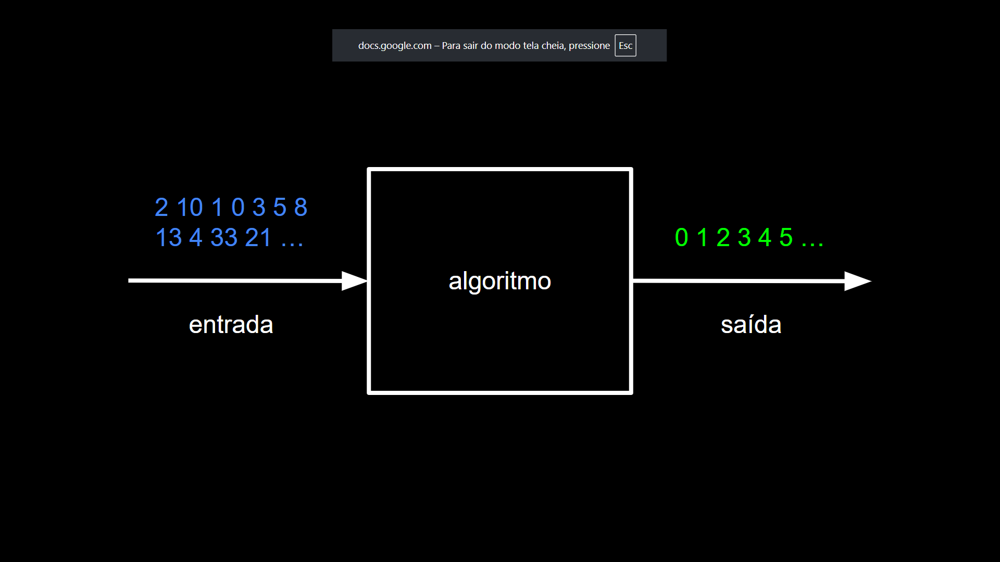
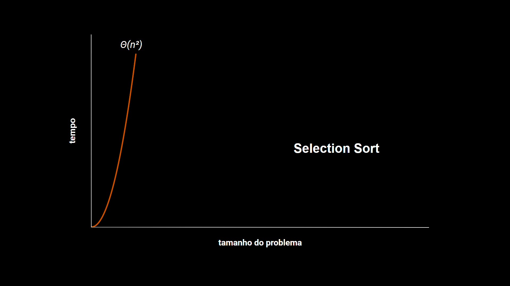

# Big O - Complexidade de Algoritmos

Oi, pessoal!

Eu fiz esse repositório com o objetivo de reforçar alguns conceitos que fazia muito tempo que havia visto. Como exercício, implementei alguns dos principais algoritmos de **ordenação** e **busca** para entender realmente como funciona a notação **Big O**.

Aproveito para compartilhar caso também ajude nos seus estudos.

Acompanhe abaixo as implementações comentadas passo a passo!

## Índice

- [Algoritmos](#algoritmos)
  - [Bubble Sort](#bubble-sort)
  - [Selection Sort](#selection-sort)
  - [Merge Sort](#merge-sort)
  - [Linear Search](#linear-search)
  - [Binary Search](#binary-search)
- [Comparativo de Complexidades](#comparativo-de-complexidades)
- [Exemplos Práticos](#algoritmos-de-ordenação-na-prática)

## Algoritmos

Bom, nós sabemos que um algoritmo nada mais é do que instruções passadas ao computador que transformam uma entrada de dados em uma saída.
Podemos avaliar o desempenho de um algoritmo analisando quanto tempo ele leva para ser executado em relação ao tamanho da entrada.



Por exemplo, qual seria o desempenho de um algoritmo que ordena uma lista de números aleatórios? E qual seria o desempenho para buscar um determinado número existente na minha lista de entrada? Bom, para saber tudo isso, devemos avaliar a complexidade (ou ordem) desse algoritmo e essa notação é chamada de Big O. 

**A notação Big O é usada para descrever o comportamento assintótico do tempo de execução (ou uso de memória) de um algoritmo à medida que a entrada cresce.**


As complexidades mais comuns dos algoritmos são as seguintes:
- O(1)
- O(N)
- O(LogN)
- O(NLogN)
- O(n²)

A notação O é utilizada para definir a complexidade do pior cenário de um algoritmo. O pior cenário de um algoritmo de ordenação ocorre quando a sua lista de entrada está completamente invertida, por exemplo: 100, 99, 98, ..., 0.

Já a notação Ω (ômega) é utilizada para definir a complexidade do algoritmo em seu melhor cenário. No caso de um algoritmo de ordenação, o melhor cenário seria quando a sua lista de entrada já está ordenada, por exemplo: 0, 1, 2, ..., 100. Nesse caso, o algoritmo levaria menos tempo (ou menos passos) para finalizar.

E por último, a notação Θ (theta) é usada quando o algoritmo apresenta o **mesmo crescimento assintótico tanto no melhor quanto no pior caso**. Ou seja, quando o tempo de execução é sempre proporcional a uma mesma função, independentemente da entrada.

Vamos entender melhor a seguir quando compararmos as complexidades de alguns algoritmos.

### Bubble Sort


O Bubble Sort é um dos algoritmos de ordenação mais simples, frequentemente usado como introdução ao tema.

- Pior caso: O(N²)
- Melhor caso: Ω(N)

``` C
void bubble_sort(int n, int *arr)
{
    for (int i = 0; i < n; i++)
    {
        int swaps = 0;

        for (int j = 0; j < n - i - 1; j++)
        {
            if (arr[j] > arr[j + 1])
            {
                swap(&arr[j], &arr[j + 1]);
                swaps++;
            }
        }

        if (swaps == 0)
            return;
    }
}
```

### Selection Sort



O Selection Sort é outro algoritmo simples e possui a mesma complexidade que o Bubble Sort nos piores casos. Entretanto, podemos dizer que o Selection Sort é mais eficiente que o Bubble Sort, pois ele realiza menos trocas durante sua execução. Embora, teoricamente, as trocas tenham complexidade O(1), na prática elas podem impactar o desempenho, especialmente em listas grandes, pois envolvem operações de escrita na memória. Por isso, ao comparar o Selection com o Bubble Sort, para as mesmas entradas, no pior e no médio caso, será vista uma execução mais rápida do Selection Sort.

- Pior e melhor caso: θ(N²)

``` C
void selection_sort(int n, int arr*)
{
    for (int i = 0; i < n; i++)
    {
        int minIndex = i;

        for (int j = i + 1; j < n; j++)
        {
            if (arr[j] < arr[minIndex])
                minIndex = j;
        }

        if (minIndex != i)
            swap(&arr[i], &arr[minIndex]);
    }
}
```

### Merge Sort


O Merge Sort é um ótimo algoritmo de ordenação para se implementar, pois ele é bastante eficiente.
Para entendermos o porquê de ele ser mais rápido, vamos analisar o seu pseudocódigo:

``` plaintext
Função merge_sort(lista)
    Se lista tem tamanho menor igual a um elemento
        Retornar

    Dividir a lista em duas metades: esquerda e direita

    Chamar merge_sort na metade esquerda
    Chamar merge_sort na metade direita

    Mesclar as duas metades ordenadas em uma lista final
```
A cada nível da recursão, o Merge Sort faz N operações de merge, e o número de níveis é log₂N (já que dividimos pela metade a cada passo). Isso resulta em uma complexidade total de N * log₂N → O(NLogN).

- Pior e melhor caso: θ(NLogN)

``` C
void merge_sort(int n, int *arr)
{
    if (n <= 1)
        return;

    int n1 = n / 2;
    int n2 = n - n1;

    int *leftArr = malloc(n1 * sizeof(int));
    int *rightArr = malloc(n2 * sizeof(int));

    for (int i = 0; i < n1; i++)
        leftArr[i] = arr[i];

    for (int i = n1; i < n; i++)
        rightArr[i - n1] = arr[i];

    merge_sort(n1, leftArr);
    merge_sort(n2, rightArr);

    int i = 0;
    int j = 0;
    int count = 0;

    while (i < n1 && j < n2)
    {
        if (leftArr[i] <= rightArr[j])
        {
            arr[count] = leftArr[i];
            i++;
        }
        else
        {
            arr[count] = rightArr[j];
            j++;
        }

        count++;
    }

    while (i < n1)
    {
        arr[count] = leftArr[i];
        i++;
        count++;
    }

    while (j < n2)
    {
        arr[count] = rightArr[j];
        j++;
        count++;
    }

    free(leftArr);
    free(rightArr);
}
```

### Linear Search


Falando agora sobre os algoritmos de busca, começaremos pelo de busca linear. É um algoritmo simples, de complexidade O(N). Ele tem apenas um único loop de repetição e compara o elemento da lista com a entrada desejada. No seu melhor cenário, quando o elemento desejado é o primeiro da lista, sua complexidade será Ω(1).

- Pior caso: O(N)
- Melhor caso: Ω(1)

``` C
void linear_search(int target, int n, int *arr)
{
    for (int i = 0; i < n; i++)
    {
        if (target == arr[i])
        {
            printf("Found at index %i.\n", i);
            return;
        }
    }

    printf("Not found.\n");
}
```

### Binary Search


Um ótimo algoritmo de busca é o de busca binária. Ele tem complexidade O(LogN) e é um algoritmo muito eficiente para listas grandes e que tendem a crescer, pois ele usa o método de divisão em conquista, que consiste em ir dividindo a lista pela metade até encontrar o elemento que se está buscando.

**IMPORTANTE:** a busca binária só funciona corretamente em listas ordenadas. Antes de utilizá-la, certifique-se de que sua lista está ordenada — caso contrário, os resultados podem ser incorretos.

Vejamos sua implementação:

``` plaintext
Função busca_binária(lista, alvo, início, fim)
    Se início > fim
        Encerrar (elemento não encontrado)

    Calcular índice do meio da lista

    Se lista[meio] < alvo
        Chamar busca_binária(lista, alvo, meio + 1, fim)

    Senão se lista[meio] > alvo
        Chamar busca_binária(lista, alvo, início, meio - 1)

    Senão
        Encerrar (elemento encontrado)
```

A cada nível da recursão, o algoritmo irá dividir a lista pela metade até que o elemento central, ou o único elemento, seja igual ao alvo que se está buscando. Por isso, a complexidade da busca binária é O(LogN) no pior caso e Ω(1) no melhor caso, quando o alvo é exatamente o elemento central da lista.

- Pior caso: O(LogN)
- Melhor caso: Ω(1)

``` C
void binary_search(int target, int startIndex, int endIndex, int *arr)
{
    if (startIndex > endIndex)
    {
        printf("Not found!\n");
        return;
    }

    int middleIndex = (startIndex + endIndex) / 2;

    if (arr[middleIndex] < target)
    {
        startIndex = middleIndex + 1;
        binary_search(target, startIndex, endIndex, arr);
    }
    else if (arr[middleIndex] > target)
    {
        endIndex = middleIndex - 1;
        binary_search(target, startIndex, endIndex, arr);
    }
    else
    {
        printf("Found at index %i!\n", middleIndex);
        return;
    }
}
```

## Comparativo de Complexidades

| Algoritmo        | Melhor Caso | Pior Caso  | Observações                            |
|------------------|-------------|------------|----------------------------------------|
| Bubble Sort      | Ω(N)        | O(N²)      | Simples, mas ineficiente               |
| Selection Sort   | Θ(N²)       | Θ(N²)      | Menos trocas que o Bubble              |
| Merge Sort       | Θ(N log N)  | Θ(N log N) | Muito eficiente, estável               |
| Linear Search    | Ω(1)        | O(N)       | Funciona em qualquer lista             |
| Binary Search    | Ω(1)        | O(log N)   | Exige lista ordenada                   |

## Algoritmos de ordenação na prática

Um ótimo exercício é comparar o tempo de execução dos algoritmos de ordenação e busca para os diversos cenários.

**IMPORTANTE:** para conseguir executar os programas abaixo, execute os seguintes comandos antes:
``` bash
chmod +x build.sh
./build.sh
```

- Lista ordenada de 0 a 100_000 (melhor caso)

``` Bash
./generate_numbers 0 100000
time ./bubble_sort numbers.txt

real    0m0.019s
user    0m0.018s
sys     0m0.000s

./generate_numbers 0 100000
time ./selection_sort numbers.txt

real    0m11.004s
user    0m10.989s
sys     0m0.010s

./generate_numbers 0 100000
time ./merge_sort numbers.txt

real    0m0.029s
user    0m0.027s
sys     0m0.000s
```

Podemos concluir que para os melhores cenários, o algoritmo de Bubble Sort foi mais eficiente, pois possui ordem linear (Ω(N)), seguido do Merge Sort (Ω(N log N)) e Selection Sort (Ω(N²).

- Lista ordenada de 100_000 a 0 (pior caso)

``` Bash
./generate_numbers 100000 0
time ./bubble_sort numbers.txt

real    0m22.913s
user    0m22.902s
sys     0m0.010s

./generate_numbers 100000 0
time ./selection_sort numbers.txt

real    0m10.032s
user    0m10.031s
sys     0m0.001s

./generate_numbers 100000 0
time ./merge_sort numbers.txt

real    0m0.032s
user    0m0.031s
sys     0m0.001s
```

Agora vemos o quão discrepante foi a diferença entre o Merge Sort (O(NLogN)), Selection Sort (O(N²)) e Bubble Sort (O(N²)).

- Lista aleatória (caso médio)

``` Bash
./generate_numbers --random 100000
time ./bubble_sort numbers.txt

real    0m30.804s
user    0m30.791s
sys     0m0.001s

./generate_numbers --random 100000
time ./selection_sort numbers.txt

real    0m11.952s
user    0m11.949s
sys     0m0.001s

./generate_numbers --random 100000
time ./merge_sort numbers.txt

real    0m0.036s
user    0m0.034s
sys     0m0.001s
```

Para casos médios, temos a confirmação das curvas assintóticas dos algoritmos de ordenação.

## Algoritmos de busca na prática

- Busca pelo número 9_999_999 em uma lista ordenada de 0 a 10_000_000

``` Bash
./generate_numbers 0 10000000
time ./linear_search 9999999 numbers.txt
Found at index 9999999!

real    0m0.732s
user    0m0.608s
sys     0m0.078s

time ./binary_search 9999999 numbers.txt
Found at index 9999999!

real    0m0.606s
user    0m0.575s
sys     0m0.030s
```

A busca binária (O(log N)) foi mais eficiente do que a busca linear (O(N)).
